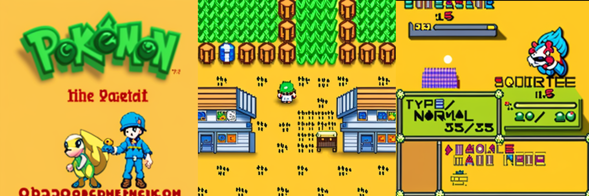

# Diffuse Boy

Wraps [PyBoy](https://github.com/Baekalfen/PyBoy) in a Stable Diffusion + ControlNet Pipeline.

It's more or less as completely unhinged as you might expect. My GPU is tiny (RTX2060, 6gb) so I run a very high frameskip with SDTurbo (base, not XL).



## To Run

Setup conda env
```
mamba create -n diffuse-boy --file ./environment.yml
mamba activate diffuse-boy
python main.py --rom_path=/path/to/rom
```

In game controls:
* **A** = Z
* **B** = X
* **START** = Enter
* **D-Pad** = Arrows
* **Toggle Diffusion** = P

## Misc TODOs

Still need to

- [] try xformers for performance
- [] try different controlnet models for results (segmentation?)
- [] try different stable diffusion fine tunes (though there aren't many for SDTurbo, might need to look into how to turbo-ify existing 1.5/2.1 models)

Other ideas that might be fun to explore:

- [] Train an image classifier for different key scenes of games or even a specific game, i.e. menu vs platformer vs topdown etc. and have prompt variations for each class.
- [] Again for the above but not just prompt variations but also input images for img2img


More boring todos:
- [] Move more configuration to argparse params
